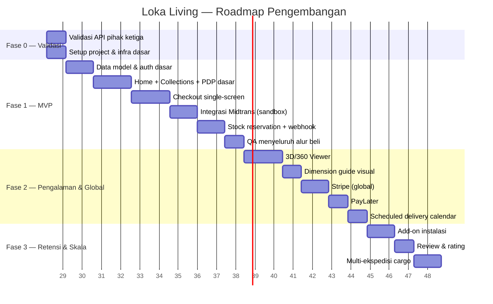

# Planning Document — Loka Living

Dokumen perencanaan eksekusi, disusun untuk konteks realistis: 1 developer, ngerjain di waktu luang setelah kerja shift. Timeline dibuat dalam satuan **minggu efektif** (asumsi ~10-15 jam coding/minggu di malam hari & weekend), bukan hari kalender kerja penuh waktu — supaya target tidak meleset jauh dari kenyataan.

---

## 1. Prinsip Perencanaan

- **Fase mengikuti PRD** (MVP → Fase 2 → Fase 3), bukan dibuat ulang dari nol.
- **Urutan build ikut ketergantungan teknis**, bukan cuma urutan tampil di PRD — misal, sistem stock reservation harus ada sebelum checkout bisa dianggap "selesai", walau secara tampilan checkout kelihatan duluan jadi.
- **Setiap fase punya "Definition of Done"** yang konkret, supaya tidak ada ambiguitas kapan boleh lanjut ke fase berikutnya.
- **Risiko teknis (integrasi API pihak ketiga) divalidasi paling awal**, bukan di akhir — karena itu yang paling mungkin bikin timeline meleset kalau ternyata butuh partnership/approval bisnis yang makan waktu.

---

## 2. Roadmap Fase (Ringkas)

*(Durasi dalam gantt dihitung sebagai hari kalender, tapi asumsikan progres efektif setara ~2 jam/hari kerja malam — jadi total proyek dari Fase 0 sampai akhir Fase 1 (MVP siap) realistisnya sekitar **3-3.5 bulan** kerja paruh waktu, bukan 2 minggu penuh waktu.)*

---

## 3. Breakdown Tugas per Fase

### Fase 0 — Validasi & Setup (sebelum coding fitur)
Tujuan: menjawab semua pertanyaan terbuka di PRD §8 supaya tidak ada kejutan besar di tengah jalan.

| Tugas | Output | Blocker jika tidak selesai |
|---|---|---|
| Cek dokumentasi API JNE Trucking/Dakota/Deliveree | Tahu mana yang self-service vs butuh partnership | Checkout tidak bisa hitung ongkir otomatis |
| Cek dokumentasi PayLater di Midtrans terbaru | Tahu apakah Kredivo/SPayLater/Akulaku sudah jadi 1 channel Midtrans | Menentukan effort integrasi Fase 2 |
| Daftar akun sandbox Midtrans & Stripe | Kredensial testing siap | Tidak bisa mulai development checkout |
| Setup repo (frontend + backend), CI dasar | Repo jalan, deploy "Hello World" ke Vercel & Railway | Semua development berikutnya |
| Setup database + jalankan migration dari `TECHNICAL-LokaLiving.md` §3 | Skema DB siap dipakai | Fase 1 |

**Definition of Done Fase 0:** Bisa deploy halaman kosong ke production URL, kredensial sandbox payment gateway sudah di tangan, dan status API cargo shipping sudah jelas (publik/perlu partnership) — kalau ternyata butuh partnership, keputusan fallback (tabel rate manual, lihat `TECHNICAL-LokaLiving.md` §5.4) sudah diambil di sini, bukan di tengah Fase 1.

### Fase 1 — MVP (fokus: alur beli inti berfungsi end-to-end)

| Tugas | Estimasi | Catatan |
|---|---|---|
| Model data + migration (products, variants, orders, dst) | 3-4 hari | Sesuai skema di `TECHNICAL-LokaLiving.md` |
| Halaman Home (static content dari `alamrupa.html`/`loka-living.html`) | 4-5 hari | Port dari prototype yang sudah ada ke Next.js |
| Halaman Collections + filter | 4-5 hari | |
| Product Detail Page (tanpa 3D dulu — galeri foto + swatch) | 5-6 hari | Swatch crossfade sudah ada polanya di prototype |
| `POST /checkout/init` + stock reservation | 3-4 hari | Ini bagian paling sensitif, kerjakan dengan hati-hati + test |
| Checkout single-screen UI (guest checkout, address form) | 5-6 hari | |
| Integrasi Google Maps Autocomplete | 2-3 hari | |
| Integrasi Midtrans Snap (sandbox) | 4-5 hari | |
| Webhook handler + idempotency + audit log | 3-4 hari | |
| Job `ReleaseExpiredReservations` | 1-2 hari | |
| About Us & Contact Us (halaman statis) | 2 hari | Paling ringan, bisa dikerjakan di sela-sela |
| QA alur beli end-to-end (manual + test otomatis area kritis) | 4-5 hari | Termasuk test concurrent checkout (2 tab browser beli produk stok terakhir bersamaan) |

**Definition of Done Fase 1 (MVP):** Orang bisa buka situs, pilih produk, checkout sebagai guest, bayar pakai QRIS/VA sandbox, dan status order berubah otomatis jadi "paid" lewat webhook — tanpa oversell dan tanpa bisa memanipulasi harga dari DevTools.

### Fase 2 — Pengalaman Produk & Pasar Global

| Tugas | Estimasi | Catatan |
|---|---|---|
| 3D Viewer (`<model-viewer>`) untuk minimal 3-5 produk unggulan | 5-7 hari | Termasuk waktu dapetin/konversi model 3D-nya (tergantung siapa yang bikin, lihat PRD §8) |
| 360° foto sequence untuk produk lain (lebih murah dari 3D penuh) | 4-5 hari | |
| Dimension guide visual (diagram, bukan cuma angka) | 3-4 hari | |
| Integrasi Stripe (sandbox) + routing lokal/global | 4-5 hari | |
| PayLater (tergantung hasil validasi Fase 0) | 3-6 hari | Range lebar karena tergantung kompleksitas integrasi aktual |
| Scheduled delivery calendar | 3-4 hari | |

**Definition of Done Fase 2:** Pembeli luar negeri bisa checkout pakai kartu/PayPal via Stripe, minimal produk unggulan punya 3D/360° viewer, dan user bisa pilih tanggal kirim dari kalender yang menyesuaikan slot.

### Fase 3 — Retensi & Skala
Fase ini fleksibel — bisa disusun ulang sesuai prioritas bisnis setelah MVP & Fase 2 live dan dapat feedback nyata dari user pertama.

| Tugas | Estimasi |
|---|---|
| Add-on unboxing & instalasi (checkbox + koordinasi vendor) | 4-6 hari |
| Review & rating produk | 4-5 hari |
| Multi-ekspedisi cargo dengan perbandingan otomatis | 5-7 hari |

---

## 4. Daftar Risiko & Rencana Mitigasi (dengan Dampak Timeline)

| Risiko | Kemungkinan | Dampak ke Timeline | Mitigasi |
|---|---|---|---|
| API Cargo shipping ternyata butuh partnership bisnis (bukan self-service) | Sedang-Tinggi | Bisa mundur 2-4 minggu kalau nunggu approval | Pakai fallback tabel rate manual di MVP (lihat TECHNICAL §5.4), integrasi API asli menyusul paralel |
| PayLater butuh integrasi terpisah (bukan cuma channel Midtrans) | Sedang | Fase 2 mundur 1-2 minggu | Push ke akhir Fase 2 / awal Fase 3 kalau kompleks, tidak blocking MVP |
| Model 3D produk belum ada/proses vendor lama | Tinggi | 3D viewer Fase 2 bisa mundur | Mulai dengan 360° foto (lebih murah & cepat), 3D penuh menyusul bertahap per produk |
| Waktu coding di malam hari lebih sedikit dari estimasi (kerja shift capek) | Tinggi | Semua fase mundur proporsional | Estimasi di atas sudah dibuat konservatif; kalau meleset, potong scope Fase 2/3 dulu, jangan potong QA di Fase 1 |
| Webhook payment gateway gagal diverifikasi dengan benar saat testing | Sedang | MVP tertahan sampai fixed — ini blocking, tidak boleh di-skip | Alokasikan waktu khusus testing webhook dengan payload asli dari sandbox, bukan cuma asumsi format |

---

## 5. Urutan Prioritas Kalau Waktu Terbatas

Kalau ternyata waktu makin sempit, urutan yang **boleh dipangkas dulu** (dari yang paling aman dipangkas ke paling tidak boleh):

1. Review & rating produk (Fase 3) — paling aman ditunda
2. Multi-ekspedisi cargo (cukup 1 ekspedisi dulu)
3. Add-on instalasi (bisa manual dulu via WhatsApp, belum perlu di sistem)
4. 3D Viewer penuh (360° foto cukup untuk validasi awal)
5. PayLater (QRIS/VA/kartu sudah cukup untuk mulai jualan)
6. Stripe/pembeli global (kalau target awal murni pasar lokal, ini bisa ditunda sampai ada permintaan nyata)

**Yang TIDAK BOLEH dipangkas** meski waktu mepet: stock reservation yang benar, verifikasi webhook signature, dan re-validasi harga di server — karena ini bukan soal fitur kurang lengkap, tapi soal duit & stok yang bisa langsung rugi kalau salah.

---

## 6. Checklist Kesiapan Sebelum Fase 1 Dimulai

- [ ] Repo frontend & backend sudah bisa deploy (walau masih kosong)
- [ ] Kredensial sandbox Midtrans & Stripe sudah di tangan
- [ ] Keputusan soal cargo API (pakai API asli / fallback manual) sudah diambil
- [ ] Skema database dari `TECHNICAL-LokaLiving.md` sudah di-migrate ke database development
- [ ] `design.md` dan prototype `loka-living.html` sudah jadi acuan komponen frontend
